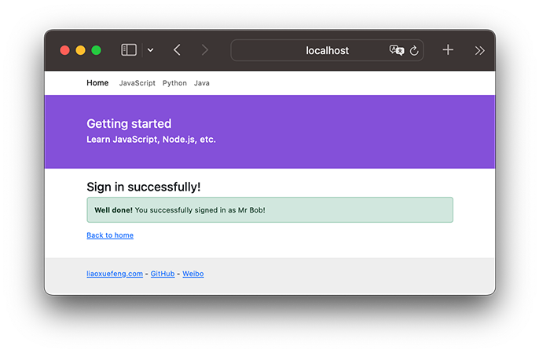
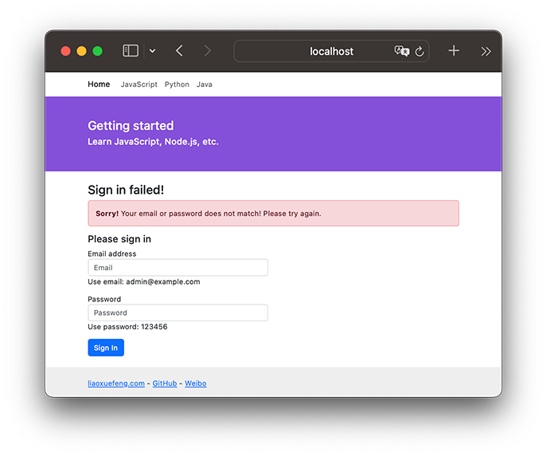

# 使用MVC

我们已经可以用koa处理不同的URL，还可以用Nunjucks渲染模板。现在，是时候把这两者结合起来了！

当用户通过浏览器请求一个URL时，koa将调用某个异步函数处理该URL。在这个异步函数内部，我们用一行代码：

```javascript
ctx.render('home.html', { name: 'Michael' });
```

通过Nunjucks把数据用指定的模板渲染成HTML，然后输出给浏览器，用户就可以看到渲染后的页面了：

```ascii
             ┌─────────────────────────────┐
HTTP Request │GET /Bob                     │
             └─────────────────────────────┘
                            │
                            │ name = Bob
                            ▼
             ┌─────────────────────────────┐
     app.mjs │GET /:name                   │
             │async (ctx, next) {          │
             │    ctx.render('home.html', {│
             │        name: ctx.params.name│
             │    });                      │
             │}                            │
             └─────────────────────────────┘
                            │
                            │ {{ name }} ─▶ Bob
                            ▼
             ┌─────────────────────────────┐
    Template │<html>                       │
             │<body>                       │
             │    <p>Hello, {{ name }}!</p>│
             │</body>                      │
             │</html>                      │
             └─────────────────────────────┘
                            │
                            │ Output
                            ▼
             ┌─────────────────────────────┐
        HTML │<html>                       │
             │<body>                       │
             │    <p>Hello, Bob!</p>       │
             │</body>                      │
             │</html>                      │
             └─────────────────────────────┘
```

这就是传说中的MVC：Model-View-Controller，中文名“模型-视图-控制器”。

异步函数是C：Controller，Controller负责业务逻辑，比如检查用户名是否存在，取出用户信息等等；

包含变量`{{ name }}`的模板就是V：View，View负责显示逻辑，通过简单地替换一些变量，View最终输出的就是用户看到的HTML。

MVC中的Model在哪？Model是用来传给View的，这样View在替换变量的时候，就可以从Model中取出相应的数据。

上面的例子中，Model就是一个JavaScript对象：

```javascript
{ name: 'Bob' }
```

下面，我们根据原来的`url2-koa`创建工程`view-koa`，把koa2、Nunjucks整合起来，然后，把原来直接输出字符串的方式，改为`ctx.render(view, model)`的方式。

工程`koa-mvc`结构如下：

```ascii
koa-mvc/
├── app.mjs
├── controller
│   ├── index.mjs
│   └── signin.mjs
├── controller.mjs
├── package-lock.json
├── package.json
├── static/  <-- 静态资源文件
│   ├── bootstrap.css
│   └── favicon.ico
├── view/  <-- html模板文件
│   ├── base.html
│   ├── index.html
│   ├── signin-failed.html
│   └── signin-ok.html
└── view.mjs
```

在`package.json`中，我们将要用到的依赖包有：

```
"@koa/bodyparser": "^5.1.1",
"@koa/router": "^12.0.1",
"koa": "^2.15.3",
"koa-mount": "^4.0.0",
"koa-static": "^5.0.0",
"nunjucks": "^3.2.4"
```

先用`npm install`安装依赖包，然后，我们准备编写以下两个Controller：

#### 处理首页 GET /

我们定义一个async函数处理首页URL`/`：

```javascript
async function index(ctx, next) {
    ctx.render('index.html', {
        title: 'Welcome'
    });
}
```

注意到koa并没有在`ctx`对象上提供`render`方法，这里我们假设应该这么使用，这样，我们在编写Controller的时候，最后一步调用`ctx.render(view, model)`就完成了页面输出。

#### 处理登录请求 POST /signin

我们再定义一个async函数处理登录请求`/signin`：

```javascript
async function signin(ctx, next) {
    let email = ctx.request.body.email || '';
    let password = ctx.request.body.password || '';
    if (email === 'admin@example.com' && password === '123456') {
        console.log('signin ok!');
        ctx.render('signin-ok.html', {
            title: 'Sign In OK',
            name: 'Mr Bob'
        });
    } else {
        console.log('signin failed!');
        ctx.render('signin-failed.html', {
            title: 'Sign In Failed'
        });
    }
}
```

由于登录请求是一个POST，我们就用`ctx.request.body.<name>`拿到POST请求的数据，并给一个默认值。

登录成功时我们用`signin-ok.html`渲染，登录失败时我们用`signin-failed.html`渲染，所以，我们一共需要以下3个View：

- index.html
- signin-ok.html
- signin-failed.html

### 编写View

在编写View的时候，我们实际上是在编写HTML页。为了让页面看起来美观大方，使用一个现成的CSS框架是非常有必要的。我们用[Bootstrap](https://getbootstrap.com/)这个CSS框架。从首页下载zip包后解压，我们把所有静态资源文件放到`/static`目录下，这样我们在编写HTML的时候，可以直接用Bootstrap的CSS，像这样：

```javascript
<link rel="stylesheet" href="/static/bootstrap.css">
```

现在，在使用MVC之前，第一个问题来了，如何处理静态文件？

我们把所有静态资源文件全部放入`/static`目录，目的就是能统一处理静态文件。在koa中，我们需要编写一个middleware，处理以`/static/`开头的URL。

如果不想自己编写处理静态文件的middleware，可以直接使用`koa-mount`和`koa-static`组合来处理静态文件：

```javascript
// 处理静态文件:
app.use(mount('/static', serve('static')));
```

上述代码大致相当于自己手写一个middleware：

```javascript
app.use(async (ctx, next) => {
    // 判断是否以指定的url开头:
    if (ctx.request.path.startsWith('/static/')) {
        // 获取文件完整路径:
        let fp = ctx.request.path;
        if (await fs.exists(ctx.request.path)) {
            // 根据扩展名设置mime:
            ctx.response.type = lookupMime(ctx.request.path);
            // 读取文件内容并赋值给response.body:
            ctx.response.body = await fs.readFile(fp);
        } else {
            // 文件不存在:
            ctx.response.status = 404;
        }
    } else {
        // 不是指定前缀的URL，继续处理下一个middleware:
        await next();
    }
});
```

### 集成Nunjucks

集成Nunjucks实际上也是编写一个middleware，这个middleware的作用是给`ctx`对象绑定一个`render(view, model)`的方法，这样，后面的Controller就可以调用这个方法来渲染模板了。

我们创建一个`view.mjs`来实现这个middleware：

```javascript
import nunjucks from 'nunjucks';

function createEnv(path, { autoescape = true, noCache = false, watch = false, throwOnUndefined = false }, filters = {}) {
    ...
    return env;
}

const env = createEnv('view', {
    noCache: process.env.NODE_ENV !== 'production'
});

// 导出env对象:
export default env;
```

使用的时候，我们在`app.mjs`添加如下代码：

```javascript
import templateEngine from './view.mjs';

// app.context是每个请求创建的ctx的原型,
// 因此把render()方法绑定在原型对象上:
app.context.render = function (view, model) {
    this.response.type = 'text/html; charset=utf-8';
    this.response.body = templateEngine.render(view, Object.assign({}, this.state || {}, model || {}));
};
```

注意到`createEnv()`函数和前面使用Nunjucks时编写的函数是一模一样的。

这里我们判断当前环境是否是production环境。如果是，就使用缓存，如果不是，就关闭缓存。在开发环境下，关闭缓存后，我们修改View，可以直接刷新浏览器看到效果，否则，每次修改都必须重启Node程序，会极大地降低开发效率。

Node.js在全局变量`process`中定义了一个环境变量`env.NODE_ENV`，为什么要使用该环境变量？因为我们在开发的时候，环境变量应该设置为`'development'`，而部署到服务器时，环境变量应该设置为`'production'`。在编写代码的时候，要根据当前环境作不同的判断。

*注意*：生产环境上必须配置环境变量`NODE_ENV = 'production'`，而开发环境不需要配置，实际上`NODE_ENV`可能是`undefined`，所以判断的时候，不要用`NODE_ENV === 'development'`。

类似的，我们在使用上面编写的处理静态文件的middleware时，也可以根据环境变量判断：

```javascript
if (!isProduction) {
    app.use(mount('/static', serve('static')));
}
```

这是因为在生产环境下，静态文件是由部署在最前面的反向代理服务器（如Nginx）处理的，Node程序不需要处理静态文件。而在开发环境下，我们希望koa能顺带处理静态文件，否则，就必须手动配置一个反向代理服务器，这样会导致开发环境非常复杂。

### 编写View

在编写View的时候，非常有必要先编写一个`base.html`作为骨架，其他模板都继承自`base.html`，这样，才能大大减少重复工作。

编写HTML不在本教程的讨论范围之内。这里我们参考Bootstrap的官网简单编写了`base.html`。

### 运行

一切顺利的话，这个`koa-mvc`工程应该可以顺利运行。运行前，我们再检查一下`app.mjs`里的middleware的顺序：

第一个middleware是记录URL以及页面执行时间：

```javascript
app.use(async (ctx, next) => {
    console.log(`Process ${ctx.request.method} ${ctx.request.url}...`);
    const start = Date.now();
    await next();
    const execTime = Date.now() - start;
    ctx.response.set('X-Response-Time', `${execTime}ms`);
});
```

第二个middleware处理静态文件：

```javascript
if (!isProduction) {
    app.use(mount('/static', serve('static')));
}
```

第三个middleware解析POST请求：

```javascript
app.use(bodyParser());
```

最后一个middleware处理URL路由：

```javascript
app.use(await controller());
```

现在，用`node app.mjs`运行代码，不出意外的话，在浏览器输入`localhost:3000/`，可以看到首页内容：


直接在首页登录，如果输入正确的Email和Password，进入登录成功的页面：



如果输入的Email和Password不正确，进入登录失败的页面：



怎么判断正确的Email和Password？目前我们在`signin.js`中是这么判断的：

```javascript
if (email === 'admin@example.com' && password === '123456') {
    ...
}
```

当然，真实的网站会根据用户输入的Email和Password去数据库查询并判断登录是否成功，不过这需要涉及到Node.js环境如何操作数据库，我们后面再讨论。

如果要以`production`模式启动app，需要设置环境变量，可以通过以下命令启动：

```plain
$ NODE_ENV=production node app.mjs
```

这样模板缓存将生效，同时不再响应静态文件请求。

### 扩展

注意到`ctx.render`内部渲染模板时，Model对象并不是传入的model变量，而是：

```javascript
Object.assign({}, ctx.state || {}, model || {})
```

这个小技巧是为了扩展。

首先，`model || {}`确保了即使传入`undefined`，model也会变为默认值`{}`。`Object.assign()`会把除第一个参数外的其他参数的所有属性复制到第一个参数中。第二个参数是`ctx.state || {}`，这个目的是为了能把一些公共的变量放入`ctx.state`并传给View。

例如，某个middleware负责检查用户权限，它可以把当前用户放入`ctx.state`中：

```javascript
app.use(async (ctx, next) => {
    var user = tryGetUserFromCookie(ctx.request);
    if (user) {
        ctx.state.user = user;
        await next();
    } else {
        ctx.response.status = 403;
    }
});
```

这样就没有必要在每个Controller的async函数中都把user变量放入model中。

### 参考源码

[koa-mvc](koa-mvc.zip)
