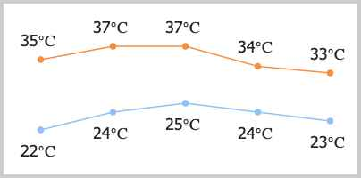

# Canvas

Canvas是HTML5新增的组件，它就像一块幕布，可以用JavaScript在上面绘制各种图表、动画等。

没有Canvas的年代，绘图只能借助Flash插件实现，页面不得不用JavaScript和Flash进行交互。有了Canvas，我们就再也不需要Flash了，直接使用JavaScript完成绘制。

一个Canvas定义了一个指定尺寸的矩形框，在这个范围内我们可以随意绘制：

```html
<canvas id="test-canvas" width="300" height="200"></canvas>
```

由于浏览器对HTML5标准支持不一致，所以，通常在`<canvas>`内部添加一些说明性HTML代码，如果浏览器支持Canvas，它将忽略`<canvas>`内部的HTML，如果浏览器不支持Canvas，它将显示`<canvas>`内部的HTML。在使用Canvas前，用`canvas.getContext`来测试浏览器是否支持Canvas：

```html
<!-- HTML代码 -->
<canvas id="test-canvas" width="200" heigth="100">
    <p>你的浏览器不支持Canvas</p>
</canvas>
```

<canvas id="test-canvas" width="200" heigth="100" style="border: 1px solid #ccc;">
    <p>你的浏览器不支持Canvas</p>
</canvas>

```x-javascript
let canvas = document.getElementById('test-canvas');
if (canvas.getContext) {
    console.log('你的浏览器支持Canvas!');
} else {
    console.log('你的浏览器不支持Canvas!');
}
```

`getContext('2d')`方法让我们拿到一个`CanvasRenderingContext2D`对象，所有的绘图操作都需要通过这个对象完成。

```javascript
let ctx = canvas.getContext('2d');
```

如果需要绘制3D怎么办？HTML5还有一个WebGL规范，允许在Canvas中绘制3D图形：

```javascript
gl = canvas.getContext("webgl");
```

本节我们只专注于绘制2D图形。

### 绘制形状

我们可以在Canvas上绘制各种形状。在绘制前，我们需要先了解一下Canvas的坐标系统：

```ascii
 0,0                20
  ┌───────────────────────▶ x
  │                 │
  │
  │                 │
10│─ ─ ─ ─ ─ ─ ─ ─ ─●
  │                  20,10
  ▼
  y
```

Canvas的坐标以左上角为原点，水平向右为X轴，垂直向下为Y轴，以像素为单位，所以每个点都是非负整数。

`CanvasRenderingContext2D`对象有若干方法来绘制图形：

```x-javascript
let
    canvas = document.getElementById('test-shape-canvas'),
    ctx = canvas.getContext('2d');

ctx.clearRect(0, 0, 200, 200); // 擦除(0,0)位置大小为200x200的矩形，擦除的意思是把该区域变为透明
ctx.fillStyle = '#dddddd'; // 设置颜色
ctx.fillRect(10, 10, 130, 130); // 把(10,10)位置大小为130x130的矩形涂色
// 利用Path绘制复杂路径:
let path=new Path2D();
path.arc(75, 75, 50, 0, Math.PI*2, true);
path.moveTo(110,75);
path.arc(75, 75, 35, 0, Math.PI, false);
path.moveTo(65, 65);
path.arc(60, 65, 5, 0, Math.PI*2, true);
path.moveTo(95, 65);
path.arc(90, 65, 5, 0, Math.PI*2, true);
ctx.strokeStyle = '#0000ff';
ctx.stroke(path);
```

<canvas id="test-shape-canvas" width="200" height="200" style="border: 1px solid #ccc;"></canvas>

### 绘制文本

绘制文本就是在指定的位置输出文本，可以设置文本的字体、样式、阴影等，与CSS完全一致：

```x-javascript
let
    canvas = document.getElementById('test-text-canvas'),
    ctx = canvas.getContext('2d');

ctx.fillStyle = '#fff';
ctx.fillRect(0, 0, 300, 100);
ctx.shadowOffsetX = 2;
ctx.shadowOffsetY = 2;
ctx.shadowBlur = 2;
ctx.shadowColor = '#ccc';
ctx.font = '28px Arial';
ctx.fillStyle = '#999';
ctx.fillText('带阴影的文字', 20, 40);
```

<canvas id="test-text-canvas" width="300" height="100" style="border: 1px solid #ccc;"></canvas>

Canvas除了能绘制基本的形状和文本，还可以实现动画、缩放、各种滤镜和像素转换等高级操作。如果要实现非常复杂的操作，考虑以下优化方案：

- 通过创建一个不可见的Canvas来绘图，然后将最终绘制结果复制到页面的可见Canvas中；
- 尽量使用整数坐标而不是浮点数；
- 可以创建多个重叠的Canvas绘制不同的层，而不是在一个Canvas中绘制非常复杂的图；
- 背景图片如果不变可以直接用``标签并放到最底层。

### 练习

请根据天气API返回的JSON数据在Canvas上绘制未来天气预报，如下图所示：



<canvas id="weather-canvas" width="400" height="200" style="border: 1px solid #ccc;"></canvas>

<a id="weather-download" href="#0" download="weather.png">下载</a>

```x-javascript
let data = [
    { high: 35, low: 22 },
    { high: 37, low: 24 },
    { high: 37, low: 25 },
    { high: 34, low: 24 },
    { high: 33, low: 23 }
];

let canvas = document.getElementById('weather-canvas');
// TODO: 绘图
// 400x200

// 下载:
let download = document.getElementById('weather-download');
download.href = canvas.toDataURL();
```
