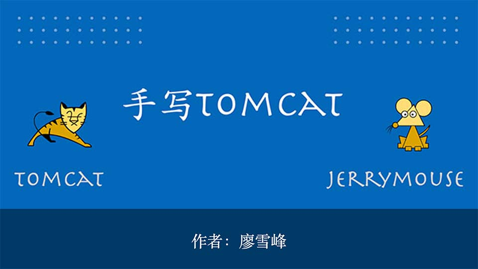
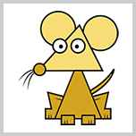

# 简介

对于Java后端开发的同学来说，[Tomcat](https://tomcat.apache.org/)服务器肯定不陌生。开发Java Web App，最后通常都会部署到Tomcat这样的服务器上。

很多同学可能觉得开发Web App是比较容易的，开发Web服务器就比较困难了。实际上，虽然开发Web服务器的难度比开发Web App要高，但也不是高得特别离谱。

对于已经能熟练开发Web App的同学来说，要进一步提升自己的架构水平，不如自己动手，从零开始编写一个Tomcat服务器。

本教程的目标就是以Tomcat服务器为原型，专注于实现一个支持Servlet标准的Web服务器，即实现一个迷你版的Tomcat Server，我们把它命名为Jerrymouse Server，与Tomcat主要区别在于，它俩的图标有所不同：

| Tomcat Server | Jerrymouse Server |
|------|----------|
|  |  |

Jerrymouse Server设计目标如下：

- 支持Servlet 6的大部分功能：
    - 支持Servlet组件；
    - 支持Filter组件；
    - 支持Listener组件；
    - 支持Sesssion（仅限Cookie模式）；
    - 不支持JSP；
    - 不支持async模式与WebSocket；
- 可部署一个标准的Web App；
- 不支持同时部署多个Web App；
- 不支持热部署。

我们会一步一步实现一个完整的Web Server，并在此基础上部署一个完整的Web应用程序。

本教程的所有源码均可从[GitHub](https://github.com/michaelliao/jerrymouse)或[Gitee](https://gitee.com/liaoxuefeng/jerrymouse)下载。
