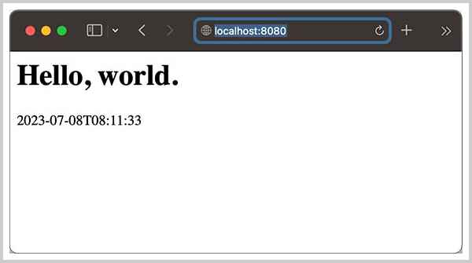

# 实现HTTP服务器

我们设计的Jerrymouse Server的架构如下：

```ascii
  ┌───────────────────────────────┐
  │       Jerrymouse Server       │
  │                 ┌───────────┐ │
  │  ┌─────────┐    │  Context  │ │
  │  │  HTTP   │    │┌─────────┐│ │
◀─┼─▶│Connector│◀──▶││ Web App ││ │
  │  └─────────┘    │└─────────┘│ │
  │                 └───────────┘ │
  └───────────────────────────────┘
```

在实现Servlet支持之前，我们先实现一个HTTP Connector。

所谓Connector，这里可以简化为一个能处理HTTP请求的服务器，HTTP/1.x协议是基于TCP连接的一个简单的请求-响应协议，首先由浏览器发送请求：

```plain
GET /hello HTTP/1.1
Host: www.example.com
User-Agent: curl/7.88.1
Accept: */*

```

请求头指出了请求的方法`GET`，主机`www.example.com`，路径`/hello`，接下来服务器解析请求，输出响应：

```plain
HTTP/1.1 200 OK
Server: Simple HttpServer/1.0
Date: Fri, 07 Jul 2023 23:15:09 GMT
Content-Type: text/html; charset=utf-8
Content-Length: 22
Connection: keep-alive

<h1>Hello, world.</h1>
```

响应返回状态码`200`，每个响应头`Header: Value`，最后是以`\r\n\r\n`分隔的响应内容。

所以我们编写HTTP Server实际上就是：

1. 监听TCP端口，等待浏览器连接；
2. 接受TCP连接后，创建一个线程处理该TCP连接：
    1. 接收浏览器发送的HTTP请求；
    2. 解析HTTP请求；
    3. 处理请求；
    4. 发送HTTP响应；
    5. 重复1～4直到TCP连接关闭。

整个流程不复杂，但是处理步骤比较繁琐，尤其是解析HTTP请求，是个体力活，不但要去读HTTP协议手册，还要做大量的兼容性测试。

所以我们选择直接使用JDK内置的`jdk.httpserver`。`jdk.httpserver`从JDK 9开始作为一个公开模块可以直接使用，它的包是`com.sun.net.httpserver`，主要提供以下几个类：

- HttpServer：通过指定IP地址和端口号，定义一个HTTP服务实例；
- HttpHandler：处理HTTP请求的核心接口，必须实现`handle(HttpExchange)`方法；
- HttpExchange：可以读取HTTP请求的输入，并将HTTP响应输出给它。

一个能处理HTTP请求的简单类实现如下：

```java
class SimpleHttpHandler implements HttpHandler {
    final Logger logger = LoggerFactory.getLogger(getClass());

    @Override
    public void handle(HttpExchange exchange) throws IOException {
        // 获取请求方法、URI、Path、Query等:
        String method = exchange.getRequestMethod();
        URI uri = exchange.getRequestURI();
        String path = uri.getPath();
        String query = uri.getRawQuery();
        logger.info("{}: {}?{}", method, path, query);
        // 输出响应的Header:
        Headers respHeaders = exchange.getResponseHeaders();
        respHeaders.set("Content-Type", "text/html; charset=utf-8");
        respHeaders.set("Cache-Control", "no-cache");
        // 设置200响应:
        exchange.sendResponseHeaders(200, 0);
        // 输出响应的内容:
        String s = "<h1>Hello, world.</h1><p>" + LocalDateTime.now().withNano(0) + "</p>";
        try (OutputStream out = exchange.getResponseBody()) {
            out.write(s.getBytes(StandardCharsets.UTF_8));
        }
    }
}
```

可见，`HttpExchange`封装了HTTP请求和响应，我们不再需要解析原始的HTTP请求，也无需构造原始的HTTP响应，而是通过`HttpExchange`间接操作，大大简化了HTTP请求的处理。

最后写一个`SimpleHttpServer`把启动`HttpServer`、处理请求连起来：

```java
public class SimpleHttpServer implements HttpHandler, AutoCloseable {
    final Logger logger = LoggerFactory.getLogger(getClass());

    public static void main(String[] args) {
        String host = "0.0.0.0";
        int port = 8080;
        try (SimpleHttpServer connector = new SimpleHttpServer(host, port)) {
            for (;;) {
                try {
                    Thread.sleep(1000);
                } catch (InterruptedException e) {
                    break;
                }
            }
        } catch (Exception e) {
            e.printStackTrace();
        }
    }

    final HttpServer httpServer;
    final String host;
    final int port;

    public SimpleHttpServer(String host, int port) throws IOException {
        this.host = host;
        this.port = port;
        this.httpServer = HttpServer.create(new InetSocketAddress("0.0.0.0", 8080), 0, "/", this);
        this.httpServer.start();
        logger.info("start jerrymouse http server at {}:{}", host, port);
    }

    @Override
    public void close() {
        this.httpServer.stop(3);
    }

    @Override
    public void handle(HttpExchange exchange) throws IOException {
        ...
    }
}
```

运行后打开浏览器，访问`http://localhost:8080`，可以看到如下输出：



这样，我们就成功实现了一个简单的HTTP Server。

### 参考源码

可以从[GitHub](https://github.com/michaelliao/jerrymouse/tree/master/step-by-step/simple-http-server)或[Gitee](https://gitee.com/liaoxuefeng/jerrymouse/tree/master/step-by-step/simple-http-server)下载源码。

<a class="git-explorer" href="https://github.com/michaelliao/jerrymouse/tree/master/step-by-step/simple-http-server">GitHub</a>
