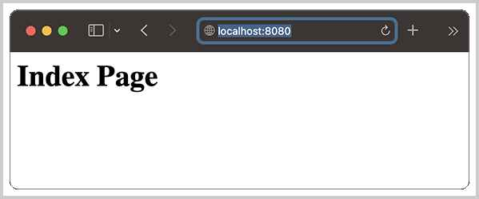
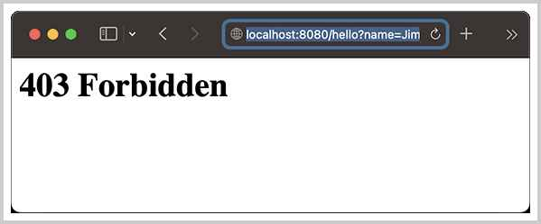

# 实现FilterChain

上一节我们实现了`ServletContext`，并且能够管理所有的Servlet组件。本节我们继续增加对Filter组件的支持。

Filter是Servlet规范中的一个重要组件，它的作用是在HTTP请求到达Servlet之前进行预处理。它可以被一个或多个Filter按照一定的顺序组成一个处理链（FilterChain），用来处理一些公共逻辑，比如打印日志、登录检查等。

Filter还可以有针对性地拦截或者放行HTTP请求，本质上一个`FilterChain`就是一个[责任链](../../java/fixme)模式。在Servlet容器中，处理流程如下：

```ascii
  ┌─────────────────┐
  │ ServletContext  │
  │ ┌ ─ ─ ─ ─ ─ ─ ┐ │
  │   FilterChain   │
  │ │ ┌─────────┐ │ │
──┼──▶│ Filter  │   │
  │ │ └─────────┘ │ │
  │        │        │
  │ │      ▼      │ │
  │   ┌─────────┐   │
  │ │ │ Filter  │ │ │
  │   └─────────┘   │
  │ │      │      │ │
  │        ▼        │
  │ │ ┌─────────┐ │ │
  │   │ Filter  │   │
  │ │ └─────────┘ │ │
  │  ─ ─ ─ ┬ ─ ─ ─  │
  │        ▼        │
  │   ┌─────────┐   │
  │   │ Servlet │   │
  │   └─────────┘   │
  └─────────────────┘
```

这里有几点需要注意：

1. 最终处理请求的Servlet是根据请求路径选择的；
2. Filter链上的Filter是根据请求路径匹配的，可能匹配0个或多个Filter；
3. 匹配的Filter将组成FilterChain进行调用。

下面，我们首先将`Filter`纳入`ServletContext`中管理。和`ServletMapping`类似，先定义`FilterMapping`，它包含一个`Filter`实例，以及将映射路径编译为正则表达式：

```java
public class FilterMapping {
    final Pattern pattern; // 编译后的正则表达式
    final Filter filter;

    public FilterMapping(String urlPattern, Filter filter) {
        this.pattern = buildPattern(urlPattern); // 编译为正则表达式
        this.filter = filter;
    }
}
```

接着，根据Servlet规范，我们需要提供`addFilter()`动态添加一个`Filter`，并且返回`FilterRegistration.Dynamic`，所以需要在`ServletContext`中实现相关方法：

```java
public class ServletContextImpl implements ServletContext {
    Map<String, FilterRegistrationImpl> filterRegistrations = new HashMap<>();
    Map<String, Filter> nameToFilters = new HashMap<>();
    List<FilterMapping> filterMappings = new ArrayList<>();

    // 根据Class Name添加Filter:
    @Override
    public FilterRegistration.Dynamic addFilter(String name, String className) {
        return addFilter(name, Class.forName(className));
    }

    // 根据Class添加Filter:
    @Override
    public FilterRegistration.Dynamic addFilter(String name, Class<? extends Filter> clazz) {
        return addFilter(name, clazz.newInstance());
    }

    // 根据Filter实例添加Filter:
    @Override
    public FilterRegistration.Dynamic addFilter(String name, Filter filter) {
        var registration = new FilterRegistrationImpl(this, name, filter);
        this.filterRegistrations.put(name, registration);
        return registration;
    }
    ...
}
```

再添加一个`initFilters()`方法用于向容器添加`Filter`：

```java
public class ServletContextImpl implements ServletContext {
    ...
    public void initFilters(List<Class<?>> filterClasses) {
        for (Class<?> c : filterClasses) {
            // 获取@WebFilter注解:
            WebFilter wf = c.getAnnotation(WebFilter.class);
            // 添加Filter:
            FilterRegistration.Dynamic registration = this.addFilter(AnnoUtils.getFilterName(clazz), clazz);
            // 添加URL映射:
            registration.addMappingForUrlPatterns(EnumSet.of(DispatcherType.REQUEST), true, AnnoUtils.getFilterUrlPatterns(clazz));
            // 设置初始化参数:
            registration.setInitParameters(AnnoUtils.getFilterInitParams(clazz));
        }
        for (String name : this.filterRegistrations.keySet()) {
            // 依次处理每个FilterRegistration.Dynamic:
            var registration = this.filterRegistrations.get(name);
            // 调用Filter.init()方法:
            registration.filter.init(registration.getFilterConfig());
            this.nameToFilters.put(name, registration.filter);
            // 将Filter定义的每个URL映射编译为正则表达式:
            for (String urlPattern : registration.getUrlPatternMappings()) {
                this.filterMappings.add(new FilterMapping(urlPattern, registration.filter));
            }
        }
    }
    ...
}
```

这样，我们就完成了对Filter组件的管理。

下一步，是改造`process()`方法，把原来直接把请求扔给`Servlet`处理，改成先匹配`Filter`，处理后再扔给最终的`Servlet`：

```java
public class ServletContextImpl implements ServletContext {
    ...
    public void process(HttpServletRequest request, HttpServletResponse response) throws IOException, ServletException {
        // 获取请求路径:
        String path = request.getRequestURI();
        // 查找Servlet:
        Servlet servlet = null;
        for (ServletMapping mapping : this.servletMappings) {
            if (mapping.matches(path)) {
                servlet = mapping.servlet;
                break;
            }
        }
        if (servlet == null) {
            // 404错误:
            PrintWriter pw = response.getWriter();
            pw.write("<h1>404 Not Found</h1><p>No mapping for URL: " + path + "</p>");
            pw.close();
            return;
        }
        // 查找Filter:
        List<Filter> enabledFilters = new ArrayList<>();
        for (FilterMapping mapping : this.filterMappings) {
            if (mapping.matches(path)) {
                enabledFilters.add(mapping.filter);
            }
        }
        Filter[] filters = enabledFilters.toArray(Filter[]::new);
        // 构造FilterChain实例:
        FilterChain chain = new FilterChainImpl(filters, servlet);
        // 由FilterChain处理:
        chain.doFilter(request, response);
    }
    ...
}
```

注意上述`FilterChain`不仅包含一个`Filter[]`数组，还包含一个`Servlet`，这样我们调用`chain.doFilter()`时，在`FilterChain`中最后一个处理请求的就是`Servlet`，这样设计可以简化我们实现`FilterChain`的代码：

```java
public class FilterChainImpl implements FilterChain {
    final Filter[] filters;
    final Servlet servlet;
    final int total; // Filter总数量
    int index = 0; // 下一个要处理的Filter[index]

    public FilterChainImpl(Filter[] filters, Servlet servlet) {
        this.filters = filters;
        this.servlet = servlet;
        this.total = filters.length;
    }

    @Override
    public void doFilter(ServletRequest request, ServletResponse response) throws IOException, ServletException {
        if (index < total) {
            int current = index;
            index++;
            // 调用下一个Filter处理:
            filters[current].doFilter(request, response, this);
        } else {
            // 调用Servlet处理:
            servlet.service(request, response);
        }
    }
}
```

注意`FilterChain`是一个递归调用，因为在执行`Filter.doFilter()`时，需要把`FilterChain`自身传进去，在执行`Filter.doFilter()`之前，就要把`index`调整到正确的值。

我们编写两个测试用的Filter：

- LogFilter：匹配`/*`，打印请求方法、路径等信息；
- HelloFilter：匹配`/hello`，根据请求参数决定放行还是返回403错误。

在初始化ServletContextImpl时将Filter加进去，先测试`http://localhost:8080/`：



观察后台输出，`LogFilter`应该起作用：

```plain
16:48:00.304 [HTTP-Dispatcher] INFO  c.i.j.engine.filter.LogFilter -- GET: /
```

再测试`http://localhost:8080/hello?name=Bob`：


观察后台输出，`HelloFilter`和`LogFilter`应该起作用：

```
16:49:31.409 [HTTP-Dispatcher] INFO  c.i.j.engine.filter.HelloFilter -- Check parameter name = Bob
16:49:31.409 [HTTP-Dispatcher] INFO  c.i.j.engine.filter.LogFilter -- GET: /hello
```

最后测试`http://localhost:8080/hello?name=Jim`：



可以看到，`HelloFilter`拦截了请求，返回403错误，最终的`HelloServlet`并没有处理该请求。

现在，我们就成功地在`ServletContext`中实现了对`Filter`的管理，以及根据每个请求，构造对应的`FilterChain`来处理请求。目前还有几个小问题：

一是和Servlet一样，Filter本身应该是Web App开发人员实现，而不是由服务器实现。我们在在服务器中写死了两个Filter，这个问题后续解决；

二是Servlet规范并没有规定多个Filter应该如何排序，我们在实现时也没有对Filter进行排序。如果要按固定顺序给Filter排序，从Servlet规范来说怎么排序都可以，通常是按`@WebFilter`定义的`filterName`进行排序，Spring Boot提供的一个`FilterRegistrationBean`允许开发人员自己定义Filter的顺序。

### 参考源码

可以从[GitHub](https://github.com/michaelliao/jerrymouse/tree/master/step-by-step/filter-chain-support)或[Gitee](https://gitee.com/liaoxuefeng/jerrymouse/tree/master/step-by-step/filter-chain-support)下载源码。

<a class="git-explorer" href="https://github.com/michaelliao/jerrymouse/tree/master/step-by-step/filter-chain-support">GitHub</a>

### 小结

实现`FilterChain`时，要首先在`ServletContext`内完成所有Filter的初始化和映射，然后，根据请求路径匹配所有合适的Filter和唯一的Servlet，构造`FilterChain`并处理请求。
