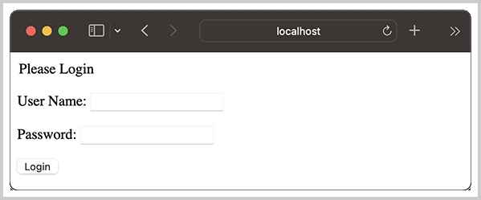

# 实现HttpSession

HttpSession是Java Web App的一种机制，用于在客户端和服务器之间维护会话状态信息。

### Session原理

当客户端第一次请求Web应用程序时，服务器会为该客户端创建一个唯一的Session ID，该ID本质上是一个随机字符串，然后，将该ID存储在客户端的一个名为`JSESSIONID`的Cookie中。与此同时，服务器会在内存中创建一个`HttpSession`对象，与Session ID关联，用于存储与该客户端相关的状态信息。

当客户端发送后续请求时，服务器根据客户端发送的名为`JSESSIONID`的Cookie中获得Session ID，然后查找对应的`HttpSession`对象，并从中读取或继续写入状态信息。

### Session用途

Session主要用于维护一个客户端的会话状态。通常，用户成功登录后，可以通过如下代码创建一个新的`HttpSession`，并将用户ID、用户名等信息放入`HttpSession`：

```java
@WebServlet(urlPatterns = "/login")
public class LoginServlet extends HttpServlet {
    @Override
    protected void doPost(HttpServletRequest req, HttpServletResponse resp) throws ServletException, IOException {
        String username = req.getParameter("username");
        String password = req.getParameter("password");
        if (loginOk(username, password)) {
            // 登录成功，获取Session:
            HttpSession session = req.getSession();
            // 将用户名放入Session:
            session.setAttribute("username", username);
            // 返回首页:
            resp.sendRedirect("/");
        } else {
            // 登录失败:
            resp.sendRedirect("/error");
        }
    }
}
```

在其他页面，可以随时获取`HttpSession`并取出用户信息，然后在页面展示给用户：

```java
@WebServlet(urlPatterns = "/")
public class IndexServlet extends HttpServlet {
    @Override
    protected void doGet(HttpServletRequest req, HttpServletResponse resp) throws ServletException, IOException {
        // 获取Session:
        HttpSession session = req.getSession();
        // 从Session中取出用户名:
        String username = (String) session.getAttribute("username");
        if (username == null) {
            // 未获取到用户名，说明未登录:
            resp.sendRedirect("/login");
        } else {
            // 获取到用户名，说明已登录:
            String html = "<p>Welcome, " + username + "!</p>";
            resp.setContentType("text/html");
            PrintWriter pw = resp.getWriter();
            pw.write(html);
            pw.close();
        }
    }
}
```

当用户登出时，需要调用`HttpSession`的`invalidate()`方法，让会话失效，这样，用户将重新回到未登录状态，因为后续调用`req.getSession()`将返回一个新的`HttpSession`，从这个新的`HttpSession`取出的`username`将是`null`。

### HttpSession的生命周期

第一次调用`req.getSession()`时，服务器会为该客户端创建一个新的`HttpSession`对象；

后续调用`req.getSession()`时，服务器会返回与之关联的`HttpSession`对象；

调用`req.getSession().invalidate()`时，服务器会销毁该客户端对应的`HttpSession`对象；

当客户端一段时间内没有新的请求，服务器会根据Session超时自动销毁超时的`HttpSession`对象。

### HttpSession接口

`HttpSession`是一个接口，Java的Web应用调用`HttpServletRequest`的`getSession()`方法时，需要返回一个`HttpSession`的实现类。

了解了以上关于`HttpSession`的相关规范后，我们就可以开始实现对`HttpSession`的支持。

首先，我们需要一个`SessionManager`，用来管理所有的Session：

```java
public class SessionManager {
    // 引用ServletContext:
    ServletContextImpl servletContext;
    // 持有SessionID -> Session:
    Map<String, HttpSessionImpl> sessions = new ConcurrentHashMap<>();
    // Session默认过期时间(秒):
    int inactiveInterval;

    // 根据SessionID获取一个Session:
    public HttpSession getSession(String sessionId) {
        HttpSessionImpl session = sessions.get(sessionId);
        if (session == null) {
            // Session未找到，创建一个新的Session:
            session = new HttpSessionImpl(this.servletContext, sessionId, inactiveInterval);
            sessions.put(sessionId, session);
        } else {
            // Session已存在，更新最后访问时间:
            session.lastAccessedTime = System.currentTimeMillis();
        }
        return session;
    }

    // 删除Session:
    public void remove(HttpSession session) {
        this.sessions.remove(session.getId());
    }
}
```

`SessionManager`由`ServletContextImpl`持有唯一实例。

再编写一个`HttpSession`的实现类`HttpSessionImpl`：

```java
public class HttpSessionImpl implements HttpSession {

    ServletContextImpl servletContext; // ServletContext
    String sessionId; // SessionID
    int maxInactiveInterval; // 过期时间(s)
    long creationTime; // 创建时间(ms)
    long lastAccessedTime; // 最后一次访问时间(ms)
    Attributes attributes; // getAttribute/setAttribute
}
```

然后，我们分析一下用户调用Session的代码：

```java
HttpSession session = request.getSession();
session.invalidate();
```

由于`HttpSession`是从`HttpServletRequest`获得的，因此，必须在`HttpServletRequestImpl`中引用`ServletContextImpl`，才能访问`SessionManager`：

```java
public class HttpServletRequestImpl implements HttpServletRequest {
    // 引用ServletContextImpl:
    ServletContextImpl servletContext;
    // 引用HttpServletResponse:
    HttpServletResponse response;

    @Override
    public HttpSession getSession(boolean create) {
        String sessionId = null;
        // 获取所有Cookie:
        Cookie[] cookies = getCookies();
        if (cookies != null) {
            // 查找JSESSIONID:
            for (Cookie cookie : cookies) {
                if ("JSESSIONID".equals(cookie.getName())) {
                    // 拿到Session ID:
                    sessionId = cookie.getValue();
                    break;
                }
            }
        }
        // 未获取到SessionID，且create=false，返回null:
        if (sessionId == null && !create) {
            return null;
        }
        // 未获取到SessionID，但create=true，创建新的Session:
        if (sessionId == null) {
            // 如果Header已经发送，则无法创建Session，因为无法添加Cookie:
            if (this.response.isCommitted()) {
                throw new IllegalStateException("Cannot create session for response is commited.");
            }
            // 创建随机字符串作为SessionID:
            sessionId = UUID.randomUUID().toString();
            // 构造一个名为JSESSIONID的Cookie:
            String cookieValue = "JSESSIONID=" + sessionId + "; Path=/; SameSite=Strict; HttpOnly";
            // 添加到HttpServletResponse的Header:
            this.response.addHeader("Set-Cookie", cookieValue);
        }
        // 返回一个Session对象:
        return this.servletContext.sessionManager.getSession(sessionId);
    }

    @Override
    public HttpSession getSession() {
        return getSession(true);
    }
    ...
}
```

对`HttpServletRequestImpl`的改造主要是加入了`ServletContextImpl`和`HttpServletResponse`的引用：可以通过前者访问到`SessionManager`，而创建的新的SessionID需要通过后者把Cookie发送到客户端，因此，在`HttpConnector`中，做相应的修改如下：

```java
public class HttpConnector implements HttpHandler {
    ...
    @Override
    public void handle(HttpExchange exchange) throws IOException {
        var adapter = new HttpExchangeAdapter(exchange);
        var response = new HttpServletResponseImpl(adapter);
        // 创建Request时，需要引用servletContext和response:
        var request = new HttpServletRequestImpl(this.servletContext, adapter, response);
        // process:
        try {
            this.servletContext.process(request, response);
        } catch (Exception e) {
            logger.error(e.getMessage(), e);
        }
    }
}
```

当用户调用`session.invalidate()`时，要让Session失效，就需要从`SessionManager`中移除：

```java
public class HttpSessionImpl implements HttpSession {
    ...
    @Override
    public void invalidate() {
        // 从SessionManager中移除:
        this.servletContext.sessionManager.remove(this);
        this.sessionId = null;
    }
    ...
}
```

最后，我们还需要实现Session的自动过期。由于我们管理的Session实际上是以`Map<String, HttpSession>`存储的，所以，让Session自动过期就是定期扫描所有的Session，然后根据最后一次访问时间将过期的Session自动删除。给`SessionManager`加一个`Runnable`接口，并启动一个Daemon线程：

```java
public class SessionManager implements Runnable {
    ...
    public SessionManager(ServletContextImpl servletContext, int interval) {
        ...
        // 启动Daemon线程:
        Thread t = new Thread(this);
        t.setDaemon(true);
        t.start();
    }

    // 扫描线程:
    @Override
    public void run() {
        for (;;) {
            // 每60秒扫描一次:
            try {
                Thread.sleep(60_000L);
            } catch (InterruptedException e) {
                break;
            }
            // 当前时间:
            long now = System.currentTimeMillis();
            // 遍历Session:
            for (String sessionId : sessions.keySet()) {
                HttpSession session = sessions.get(sessionId);
                // 判断是否过期:
                if (session.getLastAccessedTime() + session.getMaxInactiveInterval() * 1000L < now) {
                    // 删除过期的Session:
                    logger.warn("remove expired session: {}, last access time: {}", sessionId, DateUtils.formatDateTimeGMT(session.getLastAccessedTime()));
                    session.invalidate();
                }
            }
        }
    }
```

将`HttpServletRequest`和`HttpServletResponse`与Cookie相关的实现方法补全，我们就得到了一个基于Cookie的`HttpSession`实现！

最后需要注意的一点是，和`HttpServletRequest`不同，访问`HttpServletRequest`实例的一定是一个线程，因此，`HttpServletRequest`的`getAttribute()`和`setAttribute()`不需要同步，底层存储用`HashMap`即可。但是，访问`HttpSession`实例的可能是多线程，所以，`HttpSession`的`getAttribute()`和`setAttribute()`需要实现并发访问，底层存储用`ConcurrentHashMap`即可。

### 测试HttpSession

访问`IndexServlet`，第一次访问时，将获取到新的`HttpSession`，此时，`HttpSession`没有用户信息，因此显示登录表单：



登录成功后，可以看到用户名已放入`HttpSession`，`IndexServlet`从`HttpSession`获取到用户名后将用户名显示出来：


刷新页面，`IndexServlet`仍将显示登录的用户名，因为根据Cookie拿到相同的SessionID后，获取的`HttpSession`是同一个实例。

由于我们设定的`HttpSession`过期时间是10分钟，等待至少10分钟，观察控制台输出：

```plain
21:41:38.001 [HTTP-Dispatcher] INFO  c.i.j.engine.filter.LogFilter -- GET: /
21:42:05.586 [HTTP-Dispatcher] INFO  c.i.j.engine.filter.LogFilter -- GET: /
21:52:15.578 [Thread-0] WARN  c.i.j.engine.SessionManagerImpl -- remove expired session: 899eb456-5aa3-40d4-8c64-ddc97d39c0d2, last access time: Fri, 14 Jul 2023 13:42:05 GMT
```

大约在21:52:15时清理了过期的Session，最后一次访问时间是21:42:05（注意时间需要经过时区调整），再次刷新页面将显示登录表单：


### 参考源码

可以从[GitHub](https://github.com/michaelliao/jerrymouse/tree/master/step-by-step/http-session-support)或[Gitee](https://gitee.com/liaoxuefeng/jerrymouse/tree/master/step-by-step/http-session-support)下载源码。

<a class="git-explorer" href="https://github.com/michaelliao/jerrymouse/tree/master/step-by-step/http-session-support">GitHub</a>

### 小结

使用Cookie模式实现`HttpSession`时，需要实现一个`HttpSessionManager`，它在内部维护一个Session ID到`HttpSession`实例的映射；

`HttpSessionManager`通过定期扫描所有`HttpSession`，将过期的`HttpSession`自动删除，因此，Session自动失效的时间不是特别精确；

由于没有对`HttpSession`进行持久化处理，重启服务器后，将丢失所有用户的Session。如果希望重启服务器后保留用户的Session，则需要将Session数据持久化到文件或数据库，此功能要求用户放入`HttpSession`的Java对象必须是可序列化的；

因为Session不容易扩展，因此，大规模集群的Web App通常自己管理Cookie来实现登录功能，这样，将用户状态完全保存在浏览器端，不使用Session，服务器就可以做到无状态集群。
