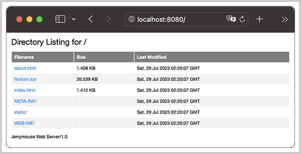

# 部署Web App

现在，我们已经实现了`WebAppClassLoader`，就可以启动Web Server、加载war包。

先编写一个简单的`hello-webapp`，实现Servlet、Filter和Listener如下：

- HelloServlet：输出一个简单的`Hello, {name}`；
- LoginServlet：使用Session实现登录功能；
- LogoutServlet：使用Session实现登出功能；
- LogFilter：打印日志的Filter；
- 若干Listener：用于监听各种事件。

用Maven打包为标准的war包，我们得到一个`hello-webapp-1.0.war`文件。

启动Web Server并加载war文件，使用以下命令：

```plain
$ java -jar /path/to/jerrymouse-1.0.0.jar -w /path/to/hello-webapp-1.0.war
```

确保路径正确，就可以看到如下输出：

```plain
10:20:07.586 [main] INFO  com.itranswarp.jerrymouse.Start -- extract '/Users/liaoxuefeng/Git/Github/jerrymouse/step-by-step/hello-webapp/target/hello-webapp-1.0.war' to '/var/folders/np/n5bzqjhs2l521tn0bkcqvzcc0000gn/T/_jm_10421889768839940273'
10:20:07.619 [main] INFO  com.itranswarp.jerrymouse.Start -- set web root: /var/folders/np/n5bzqjhs2l521tn0bkcqvzcc0000gn/T/_jm_10421889768839940273
10:20:07.943 [main] INFO  c.i.j.classloader.WebAppClassLoader -- set classes path: /var/folders/np/n5bzqjhs2l521tn0bkcqvzcc0000gn/T/_jm_10421889768839940273/WEB-INF/classes
10:20:07.944 [main] INFO  c.i.j.classloader.WebAppClassLoader -- set jar path: /var/folders/np/n5bzqjhs2l521tn0bkcqvzcc0000gn/T/_jm_10421889768839940273/WEB-INF/lib/logback-classic-1.4.6.jar
10:20:07.944 [main] INFO  c.i.j.classloader.WebAppClassLoader -- set jar path: /var/folders/np/n5bzqjhs2l521tn0bkcqvzcc0000gn/T/_jm_10421889768839940273/WEB-INF/lib/logback-core-1.4.6.jar
10:20:07.944 [main] INFO  c.i.j.classloader.WebAppClassLoader -- set jar path: /var/folders/np/n5bzqjhs2l521tn0bkcqvzcc0000gn/T/_jm_10421889768839940273/WEB-INF/lib/slf4j-api-2.0.4.jar
10:20:07.954 [main] INFO  com.itranswarp.jerrymouse.Start -- Found @WebServlet: com.itranswarp.sample.web.HelloServlet
10:20:07.955 [main] INFO  com.itranswarp.jerrymouse.Start -- Found @WebServlet: com.itranswarp.sample.web.LoginServlet
10:20:07.956 [main] INFO  com.itranswarp.jerrymouse.Start -- Found @WebServlet: com.itranswarp.sample.web.LogoutServlet
10:20:07.960 [main] INFO  com.itranswarp.jerrymouse.Start -- Found @WebFilter: com.itranswarp.sample.web.filter.LogFilter
10:20:07.962 [main] INFO  com.itranswarp.jerrymouse.Start -- Found @WebListener: com.itranswarp.sample.web.listener.HelloHttpSessionAttributeListener
10:20:07.963 [main] INFO  com.itranswarp.jerrymouse.Start -- Found @WebListener: com.itranswarp.sample.web.listener.HelloHttpSessionListener
10:20:07.964 [main] INFO  com.itranswarp.jerrymouse.Start -- Found @WebListener: com.itranswarp.sample.web.listener.HelloServletContextAttributeListener
10:20:07.965 [main] INFO  com.itranswarp.jerrymouse.Start -- Found @WebListener: com.itranswarp.sample.web.listener.HelloServletContextListener
10:20:07.966 [main] INFO  com.itranswarp.jerrymouse.Start -- Found @WebListener: com.itranswarp.sample.web.listener.HelloServletRequestAttributeListener
10:20:07.967 [main] INFO  com.itranswarp.jerrymouse.Start -- Found @WebListener: com.itranswarp.sample.web.listener.HelloServletRequestListener
10:20:08.003 [main] ERROR com.itranswarp.jerrymouse.Start -- load class 'ch.qos.logback.core.net.LoginAuthenticator' failed: NoClassDefFoundError: jakarta/mail/Authenticator
10:20:08.038 [main] INFO  c.i.j.connector.HttpConnector -- starting jerrymouse http server at 0.0.0.0:8080...
10:20:08.044 [main] INFO  c.i.j.engine.ServletContextImpl -- set web root: /var/folders/np/n5bzqjhs2l521tn0bkcqvzcc0000gn/T/_jm_10421889768839940273
10:20:08.044 [main] INFO  c.i.j.engine.ServletContextImpl -- auto register @WebListener: com.itranswarp.sample.web.listener.HelloServletRequestAttributeListener
10:20:08.045 [main] INFO  c.i.j.engine.ServletContextImpl -- auto register @WebListener: com.itranswarp.sample.web.listener.HelloHttpSessionAttributeListener
10:20:08.045 [main] INFO  c.i.j.engine.ServletContextImpl -- auto register @WebListener: com.itranswarp.sample.web.listener.HelloServletContextListener
10:20:08.045 [main] INFO  c.i.j.engine.ServletContextImpl -- auto register @WebListener: com.itranswarp.sample.web.listener.HelloHttpSessionListener
10:20:08.045 [main] INFO  c.i.j.engine.ServletContextImpl -- auto register @WebListener: com.itranswarp.sample.web.listener.HelloServletContextAttributeListener
10:20:08.045 [main] INFO  c.i.j.engine.ServletContextImpl -- auto register @WebListener: com.itranswarp.sample.web.listener.HelloServletRequestListener
```

从日志信息可知，`war`包被自动解压到临时目录，然后，初始化`WebAppClassLoader`，定位`classes`目录和`lib`目录下的所有jar包，自动扫描所有class文件，找出Servlet、Filter和Listener组件并自动注册，我们就可以在浏览器测试页面：


并在后台观察Listener输出：

```plain
10:20:49.380 [pool-1-thread-11] DEBUG c.i.j.engine.ServletContextImpl -- process /login by filter [com.itranswarp.sample.web.filter.LogFilter@7bf37a4a], servlet com.itranswarp.sample.web.LoginServlet@2a156b2d
10:20:49.380 [pool-1-thread-11] DEBUG c.i.j.engine.ServletContextImpl -- invoke ServletRequestInitialized: request = HttpServletRequestImpl@24d2901f[GET:/login]
10:20:49.380 [pool-1-thread-11] INFO  c.i.s.w.l.HelloServletRequestListener -- >>> ServletRequest initialized: HttpServletRequestImpl@24d2901f[GET:/login]
10:20:49.380 [pool-1-thread-11] INFO  c.i.sample.web.filter.LogFilter -- [GET] /login
10:20:49.383 [pool-1-thread-11] DEBUG c.i.j.engine.ServletContextImpl -- invoke HttpSessionCreated: session = HttpSessionImpl@5c0656b[id=ef81240c-12ac-414b-96e6-fe843951fd1f]
10:20:49.384 [pool-1-thread-11] INFO  c.i.s.w.l.HelloHttpSessionListener -- >>> HttpSession created: HttpSessionImpl@5c0656b[id=ef81240c-12ac-414b-96e6-fe843951fd1f]
10:20:49.385 [pool-1-thread-11] DEBUG c.i.j.engine.ServletContextImpl -- invoke ServletRequestDestroyed: request = HttpServletRequestImpl@24d2901f[GET:/login]
10:20:49.385 [pool-1-thread-11] INFO  c.i.s.w.l.HelloServletRequestListener -- >>> ServletRequest destroyed: HttpServletRequestImpl@24d2901f[GET:/login]
10:21:04.777 [pool-1-thread-12] DEBUG c.i.j.engine.ServletContextImpl -- process /login by filter [com.itranswarp.sample.web.filter.LogFilter@7bf37a4a], servlet com.itranswarp.sample.web.LoginServlet@2a156b2d
10:21:04.778 [pool-1-thread-12] DEBUG c.i.j.engine.ServletContextImpl -- invoke ServletRequestInitialized: request = HttpServletRequestImpl@73a3895e[POST:/login]
10:21:04.778 [pool-1-thread-12] INFO  c.i.s.w.l.HelloServletRequestListener -- >>> ServletRequest initialized: HttpServletRequestImpl@73a3895e[POST:/login]
10:21:04.778 [pool-1-thread-12] INFO  c.i.sample.web.filter.LogFilter -- [POST] /login
10:21:04.779 [pool-1-thread-12] DEBUG c.i.j.engine.ServletContextImpl -- invoke HttpSessionAttributeAdded: username = bob, session = HttpSessionImpl@5c0656b[id=ef81240c-12ac-414b-96e6-fe843951fd1f]
10:21:04.780 [pool-1-thread-12] INFO  c.i.s.w.l.HelloHttpSessionAttributeListener -- >>> HttpSession attribute added: username = bob
10:21:04.781 [pool-1-thread-12] DEBUG c.i.j.engine.ServletContextImpl -- invoke ServletRequestDestroyed: request = HttpServletRequestImpl@73a3895e[POST:/login]
10:21:04.781 [pool-1-thread-12] INFO  c.i.s.w.l.HelloServletRequestListener -- >>> ServletRequest destroyed: HttpServletRequestImpl@73a3895e[POST:/login]
10:21:04.790 [pool-1-thread-13] DEBUG c.i.j.engine.ServletContextImpl -- process /login by filter [com.itranswarp.sample.web.filter.LogFilter@7bf37a4a], servlet com.itranswarp.sample.web.LoginServlet@2a156b2d
10:21:04.790 [pool-1-thread-13] DEBUG c.i.j.engine.ServletContextImpl -- invoke ServletRequestInitialized: request = HttpServletRequestImpl@455863b5[GET:/login]
10:21:04.790 [pool-1-thread-13] INFO  c.i.s.w.l.HelloServletRequestListener -- >>> ServletRequest initialized: HttpServletRequestImpl@455863b5[GET:/login]
10:21:04.790 [pool-1-thread-13] INFO  c.i.sample.web.filter.LogFilter -- [GET] /login
10:21:04.791 [pool-1-thread-13] DEBUG c.i.j.engine.ServletContextImpl -- invoke ServletRequestDestroyed: request = HttpServletRequestImpl@455863b5[GET:/login]
10:21:04.791 [pool-1-thread-13] INFO  c.i.s.w.l.HelloServletRequestListener -- >>> ServletRequest destroyed: HttpServletRequestImpl@455863b5[GET:/login]
10:21:05.798 [pool-1-thread-14] DEBUG c.i.j.engine.ServletContextImpl -- process /logout by filter [com.itranswarp.sample.web.filter.LogFilter@7bf37a4a], servlet com.itranswarp.sample.web.LogoutServlet@20675c59
10:21:05.798 [pool-1-thread-14] DEBUG c.i.j.engine.ServletContextImpl -- invoke ServletRequestInitialized: request = HttpServletRequestImpl@2ea0a625[GET:/logout]
10:21:05.798 [pool-1-thread-14] INFO  c.i.s.w.l.HelloServletRequestListener -- >>> ServletRequest initialized: HttpServletRequestImpl@2ea0a625[GET:/logout]
10:21:05.798 [pool-1-thread-14] INFO  c.i.sample.web.filter.LogFilter -- [GET] /logout
10:21:05.798 [pool-1-thread-14] DEBUG c.i.j.engine.ServletContextImpl -- invoke ServletContextAttributeRemoved: username = bob, session = HttpSessionImpl@5c0656b[id=ef81240c-12ac-414b-96e6-fe843951fd1f]
10:21:05.798 [pool-1-thread-14] INFO  c.i.s.w.l.HelloHttpSessionAttributeListener -- >>> HttpSession attribute removed: username = bob
10:21:05.798 [pool-1-thread-14] DEBUG c.i.j.engine.ServletContextImpl -- invoke HttpSessionDestroyed: session = HttpSessionImpl@5c0656b[id=ef81240c-12ac-414b-96e6-fe843951fd1f]
10:21:05.798 [pool-1-thread-14] INFO  c.i.s.w.l.HelloHttpSessionListener -- >>> HttpSession destroyed: HttpSessionImpl@5c0656b[id=ef81240c-12ac-414b-96e6-fe843951fd1f]
10:21:05.799 [pool-1-thread-14] DEBUG c.i.j.engine.ServletContextImpl -- invoke ServletRequestDestroyed: request = HttpServletRequestImpl@2ea0a625[GET:/logout]
10:21:05.799 [pool-1-thread-14] INFO  c.i.s.w.l.HelloServletRequestListener -- >>> ServletRequest destroyed: HttpServletRequestImpl@2ea0a625[GET:/logout]
```

此外，因为我们没有定义映射到`/`的Servlet，因此，Web Server自动注册一个内置的`DefaultServlet`，用于显示目录：



按Ctrl+C关闭服务器，由于我们在Web Server启动时设置了ShutdownHook，所以临时目录会被自动删除。

### 参考源码

可以从[GitHub](https://github.com/michaelliao/jerrymouse/tree/master/step-by-step/hello-webapp)或[Gitee](https://gitee.com/liaoxuefeng/jerrymouse/tree/master/step-by-step/hello-webapp)下载源码。

<a class="git-explorer" href="https://github.com/michaelliao/jerrymouse/tree/master/step-by-step/hello-webapp">GitHub</a>

### 小结

通过加载war包，我们就可以完整地启动Web Server，运行一个Web App。
