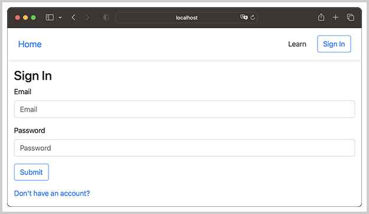
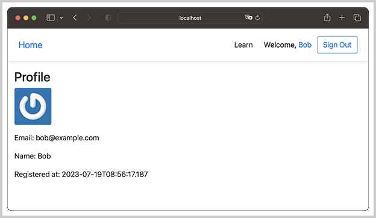

# 部署Spring Web App

现在，我们编写的Jerrymouse Server运行一个简单的`hello-webapp`没问题，那么复杂的Web App呢？

我们来编写一个基于Spring MVC的Web App。

首先，我们要加载Spring内置的`DispatcherServlet`，如果用传统的`web.xml`配置，则可以编写如下配置文件：

```xml
<?xml version="1.0"?>
<web-app>
    <servlet>
        <servlet-name>dispatcher</servlet-name>
        <servlet-class>org.springframework.web.servlet.DispatcherServlet</servlet-class>
        <init-param>
            <param-name>contextClass</param-name>
            <param-value>org.springframework.web.context.support.AnnotationConfigWebApplicationContext</param-value>
        </init-param>
        <init-param>
            <param-name>contextConfigLocation</param-name>
            <param-value>com.itranswarp.sample.AppConfig</param-value>
        </init-param>
    </servlet>
    <servlet-mapping>
        <servlet-name>dispatcher</servlet-name>
        <url-pattern>/</url-pattern>
    </servlet-mapping>
</web-app>
```

但是，我们已经干掉了通过`web.xml`配置的方式，只支持自动扫描`@WebServlet`，因此，需要编写一个继承自`DispatcherServlet`的`AppDispatcherServlet`：

```java
@WebServlet(
    urlPatterns = "/",
    initParams = {
        @WebInitParam(name = "contextClass", value = "org.springframework.web.context.support.AnnotationConfigWebApplicationContext"),
        @WebInitParam(name = "contextConfigLocation", value = "com.itranswarp.sample.AppConfig") })
public class AppDispatcherServlet extends DispatcherServlet {
}
```

这样，Jerrymouse Server会自动扫描到`AppDispatcherServlet`，然后，根据`@WebServlet`的配置，启动Spring容器，类型为`AnnotationConfigWebApplicationContext`，配置类`com.itranswarp.sample.AppConfig`，所以还需要编写配置类`AppConfig`：

```java
@Configuration
@ComponentScan
@EnableWebMvc
@EnableTransactionManagement
@PropertySource("classpath:/jdbc.properties")
public class AppConfig {
    @Bean
    WebMvcConfigurer createWebMvcConfigurer() {
        return new WebMvcConfigurer() {
            @Override
            public void addResourceHandlers(ResourceHandlerRegistry registry) {
                registry.addResourceHandler("/static/**").addResourceLocations("/static/");
                registry.addResourceHandler("/favicon.ico").addResourceLocations("/");
            }
        };
    }

    @Bean
    ViewResolver createViewResolver(@Autowired ServletContext servletContext) {
        var engine = new PebbleEngine.Builder().autoEscaping(true)
                // loader:
                .loader(new Servlet5Loader(servletContext))
                // build:
                .build();
        var viewResolver = new PebbleViewResolver(engine);
        viewResolver.setPrefix("/WEB-INF/templates/");
        viewResolver.setSuffix("");
        return viewResolver;
    }

    @Bean
    DataSource createDataSource(@Value("${jdbc.driver}") String jdbcDriver, @Value("${jdbc.url}") String jdbcUrl,
            @Value("${jdbc.username}") String jdbcUsername, @Value("${jdbc.password}") String jdbcPassword) {
        HikariConfig config = new HikariConfig();
        config.setDriverClassName(jdbcDriver);
        config.setJdbcUrl(jdbcUrl);
        config.setUsername(jdbcUsername);
        config.setPassword(jdbcPassword);
        config.addDataSourceProperty("autoCommit", "false");
        config.addDataSourceProperty("connectionTimeout", "5");
        config.addDataSourceProperty("idleTimeout", "60");
        return new HikariDataSource(config);
    }

    @Bean
    JdbcTemplate createJdbcTemplate(@Autowired DataSource dataSource) {
        return new JdbcTemplate(dataSource);
    }

    @Bean
    PlatformTransactionManager createTxManager(@Autowired DataSource dataSource) {
        return new DataSourceTransactionManager(dataSource);
    }
}
```

`AppConfig`是标准的Spring配置类，我们正常配置MVC、ViewResolver、JDBC相关的DataSource、JdbcTemplate和PlatformTransactionManager，以及Spring容器需要的Service、Controller等，就可以实现一个完整的Spring MVC的WebApp。

用Maven编译`spring-webapp`，得到`spring-webapp-1.0.war`文件。用以下命令运行：

```plain
$ java -jar /path/to/jerrymouse-1.0.0.jar -w /path/to/spring-webapp-1.0.war
```

观察`AppDispatcherServlet`的输出：

```plain
10:48:08.200 [main] DEBUG o.s.w.c.s.AnnotationConfigWebApplicationContext -- Refreshing WebApplicationContext for namespace 'appDispatcherServlet-servlet'
...
10:48:08.223 [main] DEBUG c.i.j.engine.ServletContextImpl -- invoke ServletContextAttributeAdded: org.springframework.web.context.support.ServletContextScope = org.springframework.web.context.support.ServletContextScope@2616b618
10:48:08.225 [main] DEBUG o.s.b.f.s.DefaultListableBeanFactory -- Creating shared instance of singleton bean 'org.springframework.context.annotation.internalConfigurationAnnotationProcessor'
...
10:48:08.705 [main] DEBUG c.i.sample.AppDispatcherServlet -- Detected AcceptHeaderLocaleResolver
10:48:08.705 [main] DEBUG c.i.sample.AppDispatcherServlet -- Detected FixedThemeResolver
10:48:08.706 [main] DEBUG c.i.sample.AppDispatcherServlet -- Detected org.springframework.web.servlet.view.DefaultRequestToViewNameTranslator@559fd5ec
10:48:08.706 [main] DEBUG c.i.sample.AppDispatcherServlet -- Detected org.springframework.web.servlet.support.SessionFlashMapManager@bb12f41
10:48:08.707 [main] DEBUG c.i.j.engine.ServletContextImpl -- invoke ServletContextAttributeAdded: org.springframework.web.servlet.FrameworkServlet.CONTEXT.appDispatcherServlet = WebApplicationContext for namespace 'appDispatcherServlet-servlet', started on Sat Jul 29 10:48:08 CST 2023
10:48:08.707 [HikariPool-1 connection adder] DEBUG com.zaxxer.hikari.pool.HikariPool -- HikariPool-1 - Added connection org.hsqldb.jdbc.JDBCConnection@4b7d3c3b
10:48:08.707 [main] DEBUG c.i.sample.AppDispatcherServlet -- enableLoggingRequestDetails='false': request parameters and headers will be masked to prevent unsafe logging of potentially sensitive data
10:48:08.707 [main] INFO  c.i.sample.AppDispatcherServlet -- Completed initialization in 511 ms
```

注意到`AppDispatcherServlet`是绑定到`/`的，因此，所有请求均全部由Spring提供的`DispatcherServlet`处理，包括静态文件。

访问`http://localhost:8080`，观察MVC的输出：



观察登录后的输出：



可见，Jerrymouse Server可以正常运行基于Spring MVC的Web App。不过，我们无法使用Spring提供的`async`相关功能，例如`DeferredResult`，也不能使用WebSocket相关功能。

### 参考源码

可以从[GitHub](https://github.com/michaelliao/jerrymouse/tree/master/step-by-step/spring-webapp)或[Gitee](https://gitee.com/liaoxuefeng/jerrymouse/tree/master/step-by-step/spring-webapp)下载源码。

<a class="git-explorer" href="https://github.com/michaelliao/jerrymouse/tree/master/step-by-step/spring-webapp">GitHub</a>

### 小结

通过正确配置Spring提供的`DispatcherServlet`，我们可以用Jerrymouse Server运行基于Spring MVC的Web App。
