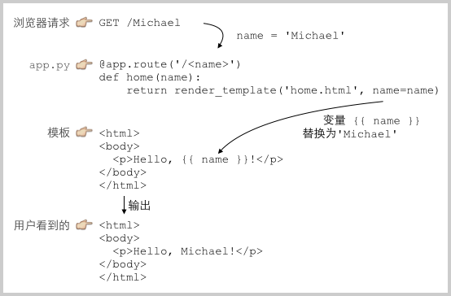

# 使用模板

Web框架把我们从WSGI中拯救出来了。现在，我们只需要不断地编写函数，带上URL，就可以继续Web App的开发了。

但是，Web App不仅仅是处理逻辑，展示给用户的页面也非常重要。在函数中返回一个包含HTML的字符串，简单的页面还可以，但是，想想新浪首页的6000多行的HTML，你确信能在Python的字符串中正确地写出来么？反正我是做不到。

俗话说得好，不懂前端的Python工程师不是好的产品经理。有Web开发经验的同学都明白，Web App最复杂的部分就在HTML页面。HTML不仅要正确，还要通过CSS美化，再加上复杂的JavaScript脚本来实现各种交互和动画效果。总之，生成HTML页面的难度很大。

由于在Python代码里拼字符串是不现实的，所以，模板技术出现了。

使用模板，我们需要预先准备一个HTML文档，这个HTML文档不是普通的HTML，而是嵌入了一些变量和指令，然后，根据我们传入的数据，替换后，得到最终的HTML，发送给用户：



这就是传说中的MVC：Model-View-Controller，中文名“模型-视图-控制器”。

Python处理URL的函数就是C：Controller，Controller负责业务逻辑，比如检查用户名是否存在，取出用户信息等等；

包含变量`{{ name }}`的模板就是V：View，View负责显示逻辑，通过简单地替换一些变量，View最终输出的就是用户看到的HTML。

MVC中的Model在哪？Model是用来传给View的，这样View在替换变量的时候，就可以从Model中取出相应的数据。

上面的例子中，Model就是一个`dict`：

```python
{ 'name': 'Michael' }
```

只是因为Python支持关键字参数，很多Web框架允许传入关键字参数，然后，在框架内部组装出一个`dict`作为Model。

现在，我们把上次直接输出字符串作为HTML的例子用高端大气上档次的MVC模式改写一下：

```python
from flask import Flask, request, render_template

app = Flask(__name__)

@app.route('/', methods=['GET', 'POST'])
def home():
    return render_template('home.html')

@app.route('/signin', methods=['GET'])
def signin_form():
    return render_template('form.html')

@app.route('/signin', methods=['POST'])
def signin():
    username = request.form['username']
    password = request.form['password']
    if username=='admin' and password=='password':
        return render_template('signin-ok.html', username=username)
    return render_template('form.html', message='Bad username or password', username=username)

if __name__ == '__main__':
    app.run()
```

Flask通过`render_template()`函数来实现模板的渲染。和Web框架类似，Python的模板也有很多种。Flask默认支持的模板是[jinja2](https://jinja.palletsprojects.com/)，所以我们先直接安装jinja2：

```plain
$ pip install jinja2
```

然后，开始编写jinja2模板：

### home.html

用来显示首页的模板：

```html
<html>
<head>
  <title>Home</title>
</head>
<body>
  <h1 style="font-style:italic">Home</h1>
</body>
</html>
```

### form.html

用来显示登录表单的模板：

```html
<html>
<head>
  <title>Please Sign In</title>
</head>
<body>
  
  <p style="color:red">{{ message }}</p>
  
  <form action="/signin" method="post">
    <legend>Please sign in:</legend>
    <p><input name="username" placeholder="Username" value="{{ username }}"></p>
    <p><input name="password" placeholder="Password" type="password"></p>
    <p><button type="submit">Sign In</button></p>
  </form>
</body>
</html>
```

### signin-ok.html

登录成功的模板：

```html
<html>
<head>
  <title>Welcome, {{ username }}</title>
</head>
<body>
  <p>Welcome, {{ username }}!</p>
</body>
</html>
```

登录失败的模板呢？我们在`form.html`中加了一点条件判断，把`form.html`重用为登录失败的模板。

最后，一定要把模板放到正确的`templates`目录下，`templates`和`app.py`在同级目录下：


启动`python app.py`，看看使用模板的页面效果：


通过MVC，我们在Python代码中处理M：Model和C：Controller，而V：View是通过模板处理的，这样，我们就成功地把Python代码和HTML代码最大限度地分离了。

使用模板的另一大好处是，模板改起来很方便，而且，改完保存后，刷新浏览器就能看到最新的效果，这对于调试HTML、CSS和JavaScript的前端工程师来说实在是太重要了。

在Jinja2模板中，我们用`{{ name }}`表示一个需要替换的变量。很多时候，还需要循环、条件判断等指令语句，在Jinja2中，用``表示指令。

比如循环输出页码：

```jinja

    <a href="/page/{{ i }}">{{ i }}</a>

```

如果`page_list`是一个list：`[1, 2, 3, 4, 5]`，上面的模板将输出5个超链接。

除了Jinja2，常见的模板还有：

- [Mako](https://www.makotemplates.org/)：用`<% ... %>`和`${xxx}`的一个模板；
- [Cheetah](https://cheetahtemplate.org/)：也是用`<% ... %>`和`${xxx}`的一个模板；
- [Django](https://www.djangoproject.com/)：Django是一站式框架，内置一个用``和`{{ xxx }}`的模板。

### 小结

有了MVC，我们就分离了Python代码和HTML代码。HTML代码全部放到模板里，写起来更有效率。

### 参考源码

[app.zip](app.zip)
