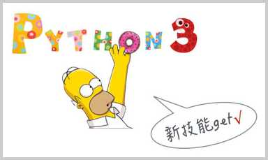

# 期末总结

终于到了期末总结的时刻了！

经过一段时间的学习，相信你对Python已经初步掌握。一开始，可能觉得Python上手很容易，可是越往后学，会越困难，有的时候，发现理解不了代码，这时，不妨停下来思考一下，先把概念搞清楚，代码自然就明白了。

Python非常适合初学者用来进入计算机编程领域。Python属于非常高级的语言，掌握了这门高级语言，就对计算机编程的核心思想——抽象有了初步理解。如果希望继续深入学习计算机编程，可以学习Java、C、JavaScript、Lisp等不同类型的语言，只有多掌握不同领域的语言，有比较才更有收获。

