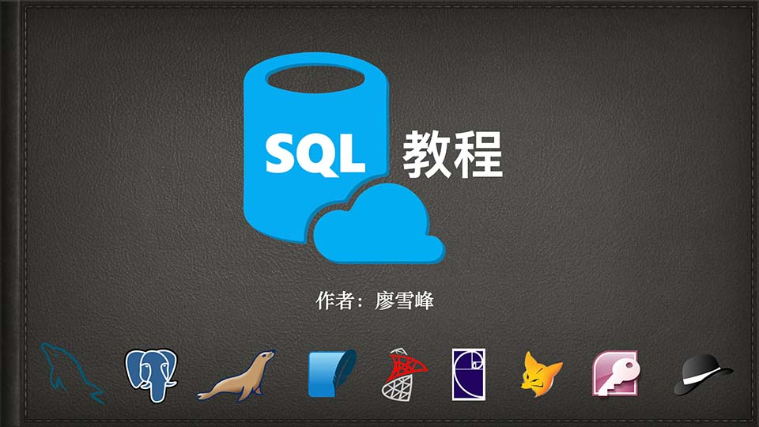

# 简介

这是小白的零基础SQL教程。

什么是SQL？简单地说，SQL就是访问和处理关系数据库的计算机标准语言。也就是说，无论用什么编程语言（Java、Python、C++……）编写程序，只要涉及到操作关系数据库，比如，一个电商网站需要把用户和商品信息存入数据库，或者一个手机游戏需要把用户的道具、通关信息存入数据库，都必须通过SQL来完成。

所以，现代程序离不开关系数据库，要使用关系数据库就必须掌握SQL。

在本教程中，你将学到关系数据库的基本概念，如何使用SQL操作数据库，以及一种最流行的开源数据库MySQL的基本安装和使用方法。

### 教程特色：可以在线运行SQL！

你可以在线直接输入并运行SQL，然后观察运行结果。当然，这个在线效果是通过集成了[AlaSQL](https://alasql.org/)这个JavaScript库实现的，它并不会保存结果，刷新页面，数据库就会恢复到初始状态。

### NoSQL

你可能还听说过NoSQL数据库，也就是非SQL的数据库，包括MongoDB、Cassandra、Dynamo等等，它们都不是关系数据库。有很多人鼓吹现代Web程序已经无需关系数据库了，只需要使用NoSQL就可以。但事实上，SQL数据库从始至终从未被取代过。回顾一下NoSQL的发展历程：

* 1970: NoSQL = We have no SQL
* 1980: NoSQL = Know SQL
* 2000: NoSQL = No SQL!
* 2005: NoSQL = Not only SQL
* 2013: NoSQL = No, SQL!

今天，SQL数据库仍然承担了各种应用程序的核心数据存储，而NoSQL数据库作为SQL数据库的补充，两者不再是二选一的问题，而是主从关系。所以，无论使用哪种编程语言，无论是Web开发、游戏开发还是手机开发，掌握SQL，是所有软件开发人员所必须的。

不要再犹豫了！从现在开始，坚持一周，拿下SQL！
