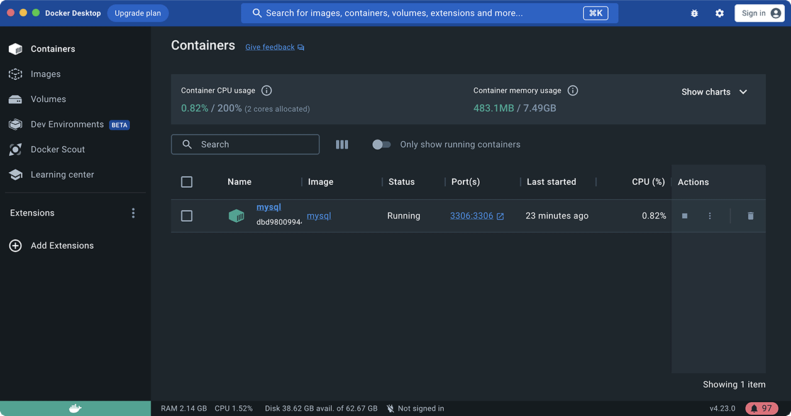
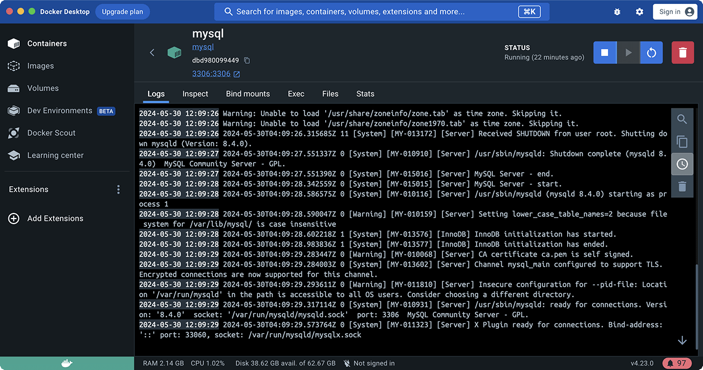
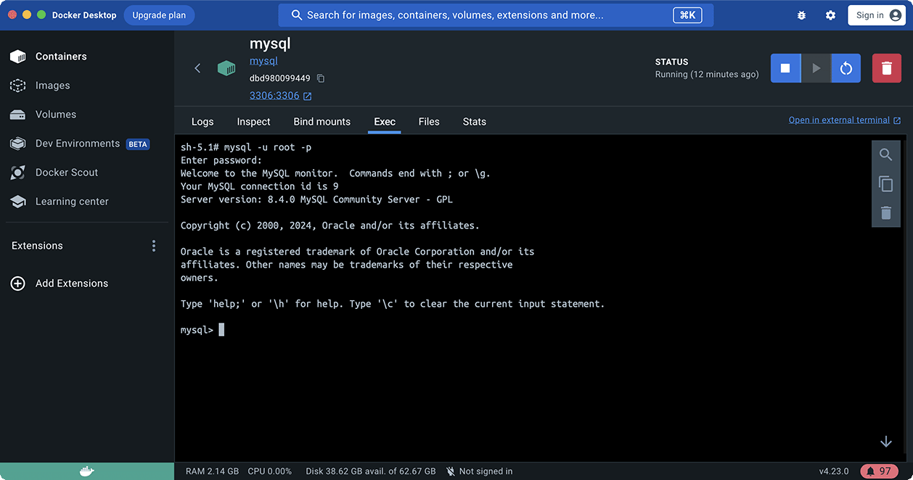

# 安装MySQL

MySQL是目前应用最广泛的开源关系数据库。MySQL最早是由瑞典的MySQL AB公司开发，该公司在2008年被SUN公司收购，紧接着，SUN公司在2009年被Oracle公司收购，所以MySQL最终就变成了Oracle旗下的产品。

和其他关系数据库有所不同的是，MySQL本身实际上只是一个SQL接口，它的内部还包含了多种数据引擎，常用的包括：

- InnoDB：由Innobase Oy公司开发的一款支持事务的数据库引擎，2006年被Oracle收购；
- MyISAM：MySQL早期集成的默认数据库引擎，不支持事务。

MySQL接口和数据库引擎的关系就好比某某浏览器和浏览器引擎（IE引擎或Webkit引擎）的关系。对用户而言，切换浏览器引擎不影响浏览器界面，切换MySQL引擎不影响自己写的应用程序使用MySQL的接口。

使用MySQL时，不同的表还可以使用不同的数据库引擎。如果你不知道应该采用哪种引擎，记住总是选择*InnoDB*就好了。

因为MySQL一开始就是开源的，所以基于MySQL的开源版本，又衍生出了各种版本：

### MariaDB

由MySQL的创始人创建的一个开源分支版本，使用XtraDB引擎。

### Aurora

由Amazon改进的一个MySQL版本，专门提供给在AWS托管MySQL用户，号称5倍的性能提升。

### PolarDB

由Alibaba改进的一个MySQL版本，专门提供给在阿里云托管的MySQL用户，号称6倍的性能提升。

而MySQL官方版本又分了好几个版本：

- Community Edition：社区开源版本，免费；
- Standard Edition：标准版；
- Enterprise Edition：企业版；
- Cluster Carrier Grade Edition：集群版。

以上版本的功能依次递增，价格也依次递增。不过，功能增加的主要是监控、集群等管理功能，对于基本的SQL功能是完全一样的。

所以使用MySQL就带来了一个巨大的好处：可以在自己的电脑上安装免费的Community Edition版本，进行学习、开发、测试，部署的时候，可以选择付费的高级版本，或者云服务商提供的兼容版本，而不需要对应用程序本身做改动。

### 安装MySQL

要安装MySQL，可以从MySQL官方网站下载最新的MySQL Community Server版本：

[https://dev.mysql.com/downloads/mysql/](https://dev.mysql.com/downloads/mysql/)

选择对应的操作系统版本，下载安装即可。在安装过程中，MySQL会自动创建一个`root`用户，并提示输入`root`口令。

要在Linux上安装MySQL，可以使用发行版的包管理器。例如，Debian和Ubuntu用户可以简单地通过命令`apt install mysql-server`安装最新的MySQL版本。

MySQL安装后会自动在后台运行。为了验证MySQL安装是否正确，我们需要通过`mysql`这个命令行程序来连接MySQL服务器。

在命令提示符下输入`mysql -u root -p`，然后输入口令，如果一切正确，就会连接到MySQL服务器，同时提示符变为`mysql>`。

输入`exit`退出MySQL命令行。注意，MySQL服务器仍在后台运行。

### 使用Docker运行MySQL

另一种运行MySQL的方式不需要下载安装包，而是直接通过Docker安装最新的MySQL：

首先安装[Docker Desktop](https://www.docker.com/products/docker-desktop/)，然后在命令行输入以下命令拉取MySQL最新版：

```plain
$ docker pull mysql
```

拉取完成后，输入以下命令直接启动MySQL服务器：

```plain
$ docker run -d --name mysql -p 3306:3306 -e MYSQL_ROOT_PASSWORD=password -v /Users/liaoxuefeng/mysql-data:/var/lib/mysql mysql
```

命令`docker run`表示启动一个容器，后面各参数含义如下：

- `-d`：表示在后台执行；
- `--name mysql`：表示容器的名字，不输入Docker会自动选择一个名字；
- `-p 3306:3306`：表示把容器的端口3306映射到本机，这样可以在本机通过3306端口连接MySQL；
- `-e MYSQL_ROOT_PASSWORD=password`：表示传入一个环境变量，作为root的口令，这里设置的口令是`password`，不输入此项则会自动生成一个口令，需要查看日志才能知道口令；
- `-v /Users/liaoxuefeng/mysql-data:/var/lib/mysql`：表示将本地目录映射到容器目录`/var/lib/mysql`作为MySQL数据库存放的位置，需要将`/Users/liaoxuefeng/mysql-data`改为你的电脑上的实际目录；
- `mysql`：最后一个参数是Docker镜像的名称。

可以在Docker Desktop的管理窗口中选择`Containers`，看到正在运行的MySQL：



点击MySQL查看日志：



点击Exec进入命令行，输入命令`mysql -u root -p`，输入口令，即可进入MySQL命令行界面：



使用Docker运行MySQL时，任何时候都可以删除MySQL容器并重新运行。如果删除了本地映射的目录，重新运行就相当于一个全新的MySQL，因此，建议仅作为学习和开发使用，不要存储重要的数据。
