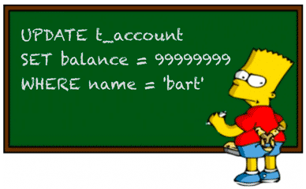

# 更新数据

如果要更新数据库表中的记录，我们就必须使用`UPDATE`语句。



`UPDATE`语句的基本语法是：

```sql
UPDATE <表名> SET 字段1=值1, 字段2=值2, ... WHERE ...;
```

例如，我们想更新`students`表`id=1`的记录的`name`和`score`这两个字段，先写出`UPDATE students SET name='大牛', score=66`，然后在`WHERE`子句中写出需要更新的行的筛选条件`id=1`：

```x-sql
-- 更新id=1的记录:
UPDATE students SET name='大牛', score=66 WHERE id=1;
-- 查询并观察结果:
SELECT * FROM students WHERE id=1;
```

注意到`UPDATE`语句的`WHERE`条件和`SELECT`语句的`WHERE`条件其实是一样的，因此完全可以一次更新多条记录：

```x-sql
-- 更新id=5,6,7的记录:
UPDATE students SET name='小牛', score=77 WHERE id>=5 AND id<=7;
-- 查询并观察结果:
SELECT * FROM students;
```

在`UPDATE`语句中，更新字段时可以使用表达式。例如，把所有80分以下的同学的成绩加10分：

```x-sql
-- 更新score<80的记录:
UPDATE students SET score=score+10 WHERE score<80;
-- 查询并观察结果:
SELECT * FROM students;
```

其中，`SET score=score+10`就是给当前行的`score`字段的值加上了10。

如果`WHERE`条件没有匹配到任何记录，`UPDATE`语句不会报错，也不会有任何记录被更新。例如：

```x-sql
-- 更新id=999的记录:
UPDATE students SET score=100 WHERE id=999;
-- 查询并观察结果:
SELECT * FROM students;
```

最后，要特别小心的是，`UPDATE`语句可以没有`WHERE`条件，例如：

```sql
UPDATE students SET score=60;
```

这时，整个表的所有记录都会被更新。所以，在执行`UPDATE`语句时要非常小心，最好先用`SELECT`语句来测试`WHERE`条件是否筛选出了期望的记录集，然后再用`UPDATE`更新。

### MySQL

在使用MySQL这类真正的关系数据库时，`UPDATE`语句会返回更新的行数以及`WHERE`条件匹配的行数。

例如，更新`id=1`的记录时：

```plain
mysql> UPDATE students SET name='大宝' WHERE id=1;
Query OK, 1 row affected (0.00 sec)
Rows matched: 1  Changed: 1  Warnings: 0
```

MySQL会返回`1`，可以从打印的结果`Rows matched: 1  Changed: 1`看到。

当更新`id=999`的记录时：

```plain
mysql> UPDATE students SET name='大宝' WHERE id=999;
Query OK, 0 rows affected (0.00 sec)
Rows matched: 0  Changed: 0  Warnings: 0
```

MySQL会返回`0`，可以从打印的结果`Rows matched: 0  Changed: 0`看到。

### 小结

使用`UPDATE`，我们就可以一次更新表中的一条或多条记录。
