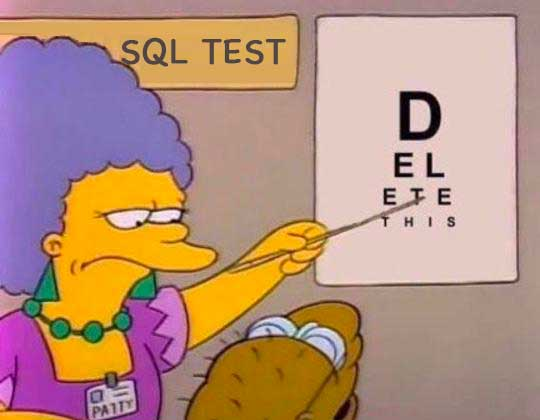

# 删除数据

如果要删除数据库表中的记录，我们可以使用`DELETE`语句。



`DELETE`语句的基本语法是：

```sql
DELETE FROM <表名> WHERE ...;
```

例如，我们想删除`students`表中`id=1`的记录，就需要这么写：

```x-sql
-- 删除id=1的记录:
DELETE FROM students WHERE id=1;
-- 查询并观察结果:
SELECT * FROM students;
```

注意到`DELETE`语句的`WHERE`条件也是用来筛选需要删除的行，因此和`UPDATE`类似，`DELETE`语句也可以一次删除多条记录：

```x-sql
-- 删除id=5,6,7的记录:
DELETE FROM students WHERE id>=5 AND id<=7;
-- 查询并观察结果:
SELECT * FROM students;
```

如果`WHERE`条件没有匹配到任何记录，`DELETE`语句不会报错，也不会有任何记录被删除。例如：

```x-sql
-- 删除id=999的记录:
DELETE FROM students WHERE id=999;
-- 查询并观察结果:
SELECT * FROM students;
```

最后，要特别小心的是，和`UPDATE`类似，不带`WHERE`条件的`DELETE`语句会删除整个表的数据：

```sql
DELETE FROM students;
```

这时，整个表的所有记录都会被删除。所以，在执行`DELETE`语句时也要非常小心，最好先用`SELECT`语句来测试`WHERE`条件是否筛选出了期望的记录集，然后再用`DELETE`删除。

### MySQL

在使用MySQL这类真正的关系数据库时，`DELETE`语句也会返回删除的行数以及`WHERE`条件匹配的行数。

例如，分别执行删除`id=1`和`id=999`的记录：

```plain
mysql> DELETE FROM students WHERE id=1;
Query OK, 1 row affected (0.01 sec)

mysql> DELETE FROM students WHERE id=999;
Query OK, 0 rows affected (0.01 sec)
```

### 小结

使用`DELETE`，我们就可以一次删除表中的一条或多条记录。
