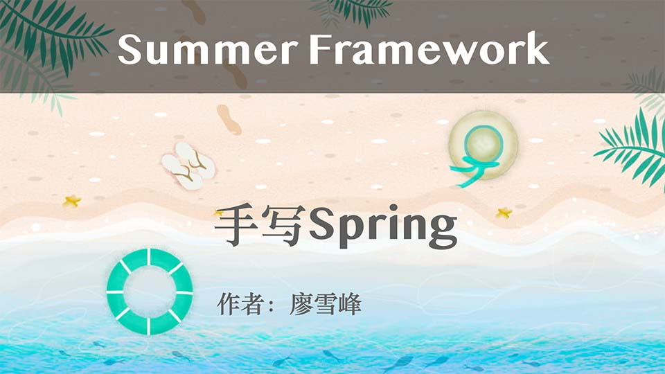

# 简介

对于Java后端开发的同学来说，Spring框架已经是事实上的标准，如果对Spring和Spring Boot还不熟悉，那需要立刻抓紧时间学习[Spring](../../java/spring/index.html)和[Spring Boot](../../java/springboot/index.html)。对于已经能熟练使用Spring框架的同学来说，要进一步理解Spring的设计思想，提升自己的架构能力，不如自己动手，从零开始编写一个Spring框架。

本教程的目标就是以Spring框架为原型，专注于实现Spring的核心功能，编写一个迷你版的Spring框架，我们把它命名为Summer Framework，与Spring主要区别在于，它俩的图标有所不同：

| Spring Framework | Summer Framework |
|------|----------|
|  |  |

Summer Framework设计目标如下：

- context模块：实现ApplicationContext容器与Bean的管理；
- aop模块：实现AOP功能；
- jdbc模块：实现JdbcTemplate，以及声明式事务管理；
- web模块：实现Web MVC和REST API；
- boot模块：实现一个简化版的“Spring Boot”，用于打包运行。

我们会一步一步实现各模块，并在此基础上开发完整的应用程序。

本教程的所有源码均可从[GitHub](https://github.com/michaelliao/summer-framework)或[Gitee](https://gitee.com/liaoxuefeng/summer-framework)下载。
